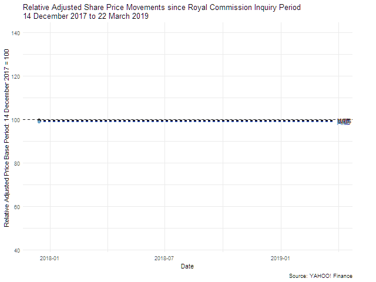

# Share Price Animation
Share Price Volume Animation in R

A function using R  <a href="https://cran.r-project.org/web/packages/gganimate/index.html">gganimate</a> and <a href="https://cran.r-project.org/web/packages/quantmod/index.html"> quantmod </a> library to download share price and volume data to plot Price / Volume Chart Animation using 60 days recent closing price. Further using <a href="https://cran.r-project.org/web/packages/magick/index.html"> magick </a> library to stack Price Volume Chart Animation together and export gif if required. When running this function in R studio, the result should be shown in the Viewer panel like this.  
 
  
Please use https://finance.yahoo.com/lookup for stock code.

# Run Function
ani_Price_60(stock_code = "^DJI", download = TRUE)

# 
 <b> Relative share price movement animation </b> to show adjusted share price relative movement since Royal Commission into Misconduct in the Banking, Superannuation and Financial Services Industry in Australia for illustartion purpose. 
   
 <a href=".">Refresh</a> page to re-run animation
 
 

